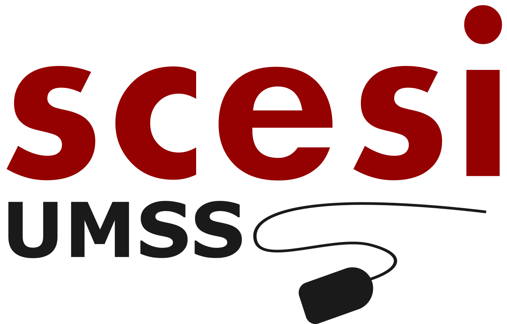
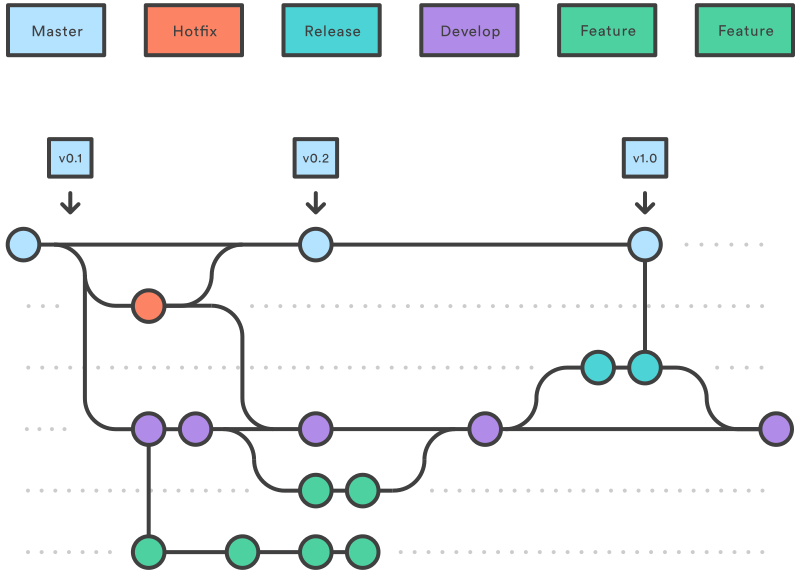
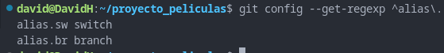

# TRABAJO GRUPAL POSTULANTES SCESI 2025

---
## 💯 Equipo **GITFLOW** 💯
## Descripción del proyecto
Este es un mini-proyecto de una página web sobre peliculas y sus respectivas categorias, **con el proposito de colocar en practica todos nuestros conocimientos adquiridos en Git y Github**.

## Enlace del sitio web
Nota: por razos extraordinarias las imagenes no son visualizables.
Link: 👉[https://doggy64.github.io/catalogo_peliculas/](https://doggy64.github.io/catalogo_peliculas/)

## Gitflow utilizado 🌟

Para organizar nuestro flujo de trabajo colaborativo, implementamos la metodología **GitFlow**, lo cual nos permitió mantener un desarrollo ordenado, predecible y fácilmente integrable entre los miembros del equipo, se utilizaron las siguientes ramas:

* 🌳 `main:` Contiene el código en producción. 
* 🧑‍💻 `develop:` Contiene el código en desarrollo. 
* 🌿 `feature/nombre:` Cada nueva funcionalidad se desarrolló en su propia rama. 
* 🔥 `hotfix/nombre:` Correcciones urgentes sobre main. 
* 🔍 `release/nombre-versión:` Se utilizó esta rama para pruebas finales antes de integrar a main. 

### Flujo de trabajo 🛠️

El flujo de trabajo consistió en:
1. Crear una rama feature a partir de develop para desarrollar una nueva funcionalidad.

2. Una vez finalizada, se creaba un Pull Request o merge desde feature hacia develop.

3. Las ramas hotfix partían desde main y, al terminarse, se mergeaban a main.

4. Al finalizar el develop, se realizó una integración a release para pruebas finales y correcciones minimas.

5. Al terminar en el release se mergeaban a main para sacar una versión terminada del software.

## 5 Buenas practicas communes
1. Commits con 50 caracteres maximo.
2. Comentarios de commits con minusculas.
3. Verbo imperativo en los commits add, change, fix, remove.
4. Utilización de los prefijos como **feat**
5. Commits constantes de pequeñas funcionalidades.
## Bitacora del mini-proyecto 📘

**Utilidades de implementar Gitflow**

La implementación del Gitflow fue de gran utilidad ya que teniamos una estructura de ramas las cuales teniamos que seguir, y el equipo fue mas organizado cuando conocio esa estructura ya que todos teniamos nuestras ramas a partir del develop y fuimos siguiendo todos los pasos que nos indicaba Gitflow ademas implementamos tag para las versiones que indica Gitflow.

**Problemas al usar Gitflow**

Como era un flujo de trabajo que recien estabamos conociendo no realizamos la implementación bien al inicio, por que creamos las primeras ramas iniciales(Feature) del main directamente y teniamos que crearlas al partir del develop.

**Conflictos que aparecieron**

Al subir las peliculas en categoria drama en el bloque de las lineas de codigo inicialmente ya estaban con un codigo que subieron y cuando otro integrante intendo hacer una pull request en ese bloque de codigo estaba intentando camiar esas lineas, en el github le aparecia con que cambio se queria quedar.

**Peronas que generaron conflictos**

**Jhamil** subio el codigo inicial de las categorias de peliculas y eso genero el conflicto cuando **Jhonny** intento hacer su pull request a su categoria añadiendo nuevas peliculas.

## Buenas y malas practicas utilizadas en el proyecto ✅ ❌

### Rodrigo documentando a David 👀

Durante el desarrollo del proyecto David fue mejorando progresivamente, inicialmente realizaba los commits con uso de mayúsculas y sin prefijos, posteriormente el avanzar de las clases fue mejorando notablemente en la calidad de sus commits evitando el uso de mayúsculas y utilizando los prefijos correctos y el verbo imperativo,realizo pull request con los miembros del equipo e implemento los tags iniciales.

### David documentando a Jhamil 👀

**Malas practicas**

Inicialmente estaba escribiendo mal los commits ya que no tenian add al iniciar su commentario de commit y contenian letras mayusculas ya que sabemos que todo tiene que estan con miniscula, olvidaba colocar los prefijos como **feat:** en los commits.

**Buenas practicas**

Despues escribio los commits con el prefijo **feat:** y utilizo el verbo imperativo add en los commits, fueron muy compresibles sus commits, no pasaban de los 50 caracteres, realizaba commits constantes pero de valor, ademas creaba pull request y abria una discusión para que todos revisemos el pull request y confirmara los cambios.

### Jhamil documentando a Jhonny 👀

Jhonny contribuyó activamente desde el inicio del proyecto hasta su culminación, con bastante dedicación y proactividad. El subió los estilos iniciales en css, y posteriormente creó una rama para agregar películas de drama al proyecto. La mayoría de sus commit son justamente agregando películas, al principio no usaba un prefijo para nombrar sus commits, usaba mayúsculas en algunas palabras, y tenía algunas pequeñas fallas ortográfias. Sin embargo fue aprendiendo de sus errores y mejoró el nombrado de sus commits a lo largo del proyecto. Creo que sobra decir que su trabajo con respecto al código del proyecto también fue espléndido y sin errores. Me gustaría volver a trabajar con él en un futuro.

### Jhonny documentando a Rodrigo 👀
Desde un inicio Rodrigo fue una persona proactiva, inicio subiendo cambios y funcionalidad entre categorías en scrip js con buenas practicas en la estructura del commit pero con el uso de mayúsculas y sin el prefijos, posteriormente mejoro la estructura de sus commits con minúsculas, prefijos y verbo imperativo también realizo discusiones con la pull request e implemento issues como recordatorio de buenas y malas practicas en el proyecto dependiendo del desarrollador, subio paulatinamente peliculas e implemento tags para las versiones del softwere.
Fue una buena experiencia haber trabajado con el equipo espero pronto volver a desarrollar softwere, hasta otra oportunidad, un abrazo.

## Git hooks o git alias utilizadas como equipo 👥
Como equipo implementamos los alias que mas utilizamos, en este caso fue para el switch y branch.
* **switch:** Su importancia fue que teniamos que movernos a cada momento de una rama a otra cuando haciamos reuniones meet al comento de cordinar y resumiendo este comando con solo el alias **sw** nos facilito mucho ese trabajo.

* **branch:** Como nos moviamos entre ramas teniamos que verificar en que rama estabamos y por esa razon utilizamos el alias br para hacerlo mas rapido.

## Finalización del proyecto y despedida, ¡hasta la proxima! 😢

## Desarrolladores

1. 👨‍💻😸 David Huanca Ledezma 
2. 👨‍💻🐶 Rodrigo Chocamani Borda
3. 👨‍💻🐆 Jhamil Jesús Arnez Hidalgo
4. 👨‍💻🦭 Jhonny Leonardo Rivas Olivera 

Fue un gusto trabajar con todos ustedes como equipo, nos vemos en otra oportunidad.
